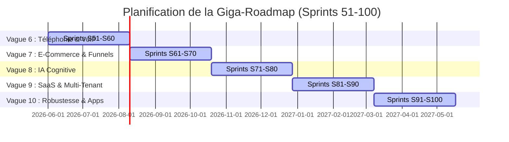

# GIGA-ROADMAP 100 SPRINTS — Moteur de parité GHL & Souveraineté Logicielle

Ce document constitue la feuille de route d'ingénierie à long terme pour **Intralys CRM**, s'étendant du **Sprint 51 au Sprint 100**. La vision directrice est de combler à 100% l'écart fonctionnel avec GoHighLevel (GHL) tout en consolidant les forces souveraines d'Intralys (Loi 25 québécoise, conformité LCAP, IA francophone locale, performance Edge).

La stack de développement reste unifiée :
- **Runtime** : Bun (exclusif)
- **Base de données Edge** : Cloudflare D1
- **Stockage de fichiers** : Cloudflare R2
- **Temps réel et états** : Cloudflare Durable Objects (DO)
- **Routage et statiques** : Cloudflare Workers & Pages
- **Framework frontend** : React + Tailwind CSS v4 + TypeScript strict

---

## 🗺️ Vues d'ensemble des Vagues Technologiques (S51 - S100)

---

## 📞 Vague 6 (S51 - S60) : Téléphonie Avancée & VoIP

### S51 (seq146) — Routage Dynamique de Numéros Virtuels
* **Pitch** : Permettre au tenant d'acheter des numéros de téléphone virtuels via Twilio directement depuis l'UI et de configurer des règles de routage selon l'indicatif régional du lead.
* **Migration** : `CREATE TABLE phone_numbers (id TEXT PRIMARY KEY, client_id TEXT, phone_number TEXT, provider TEXT, status TEXT, friendly_name TEXT, created_at DATETIME DEFAULT CURRENT_TIMESTAMP);`
* **Détails** : 
  - Backend : API d'achat/recherche de numéros Twilio.
  - Frontend : Page d'achat et d'affectation de numéros de téléphone par sous-compte.

### S52 (seq147) — IVR Visuel & Serveur Vocal Interactif
* **Pitch** : Un constructeur de serveurs vocaux interactifs par glisser-déposer de nœuds (Appel entrant -> Lire texte / Jouer un fichier R2 -> Capturer touches DTMF -> Rediriger).
* **Migration** : `CREATE TABLE ivr_menus (id TEXT PRIMARY KEY, client_id TEXT, name TEXT, config_json TEXT, created_at DATETIME);`
* **Détails** : 
  - Backend : Route TwiML dynamique résolvant les actions IVR en base de données.
  - Frontend : Éditeur graphique d'arbre de décision d'appels.

### S53 (seq148) — Messagerie Vocale (Voicemail) & Transcription Whisper
* **Pitch** : Boîte vocale personnalisée par utilisateur, stockage des enregistrements `.wav` sur R2, et transcription en texte par Whisper OpenAI avec envoi de courriel de notification.
* **Migration** : `CREATE TABLE voicemails (id TEXT PRIMARY KEY, call_id TEXT, user_id TEXT, audio_r2_key TEXT, duration INTEGER, transcript TEXT, is_read INTEGER DEFAULT 0, created_at DATETIME);`
* **Détails** : 
  - Backend : Endpoint d'enregistrement de fichier binaire sur R2 et appel au worker d'analyse Whisper.
  - Frontend : Liste et lecteur audio des messages vocaux dans l'Inbox.

### S54 (seq149) — Power Dialer (Moteur d'Appels en Rafale)
* **Pitch** : Permettre aux agents de sélectionner une liste de leads et de lancer une session d'appels consécutifs automatisés avec script de vente affiché à l'écran.
* **Migration** : `CREATE TABLE dialer_campaigns (id TEXT PRIMARY KEY, client_id TEXT, name TEXT, leads_json TEXT, status TEXT, current_index INTEGER DEFAULT 0, created_at DATETIME);`
* **Détails** : 
  - Backend : API de progression de campagne et synchronisation des statuts d'appels.
  - Frontend : Panneau d'appels superposé (floating dialer panel) avec script dynamique.

### S55 (seq150) — Enregistrement des Appels & Consentement Loi 25
* **Pitch** : Enregistrement à la demande ou automatique des appels SIP, génération automatique d'une annonce vocale de consentement aux normes canadiennes (LCAP/Loi 25) au décroché.
* **Migration** : `ALTER TABLE call_logs ADD COLUMN recording_r2_key TEXT; ALTER TABLE call_logs ADD COLUMN consent_given INTEGER DEFAULT 0;`
* **Détails** : 
  - Backend : Paramétrage TwiML `<Record>` dynamique déclenché après confirmation DTMF.
  - Frontend : Section d'écoute des appels dans le journal de communication.

### S56 (seq151) — Intégration WhatsApp Business API Directe
* **Pitch** : Envoyer et recevoir des messages multimédias via l'API Cloud de Meta WhatsApp, gestion des modèles de messages approuvés.
* **Migration** : `CREATE TABLE whatsapp_configs (client_id TEXT PRIMARY KEY, phone_number_id TEXT, waba_id TEXT, access_token TEXT, verify_token TEXT);`
* **Détails** : 
  - Backend : Webhook de réception d'événements Meta et parsing des payloads JSON dans Durable Objects.
  - Frontend : Inclusion de l'icône et des conversations WhatsApp dans la boîte de réception unifiée.

### S57 (seq152) — Canaux Internes de Discussion Équipe (Slack-like)
* **Pitch** : Canaux de clavardage internes au tenant pour la communication d'équipe, sans polluer les conversations clients.
* **Migration** : `CREATE TABLE internal_channels (id TEXT PRIMARY KEY, client_id TEXT, name TEXT, description TEXT, is_private INTEGER DEFAULT 0, created_at DATETIME);`
* **Détails** : 
  - Backend : Durable Objects gérant les salons de discussions et la présence en ligne en temps réel.
  - Frontend : Section "Clavardage Interne" dans la barre latérale gauche.

### S58 (seq153) — Softphone SIP WebRTC Intégré
* **Pitch** : Passer et recevoir des appels directement depuis le navigateur sans matériel téléphonique, en utilisant Twilio WebRTC Voice Client.
* **Migration** : Aucune migration requise (utilisation des jetons d'accès éphémères du worker).
* **Détails** : 
  - Backend : Endpoint de génération de token d'identité Twilio Device.
  - Frontend : Barre d'appel flottante persistante dans l'UI avec pavé numérique.

### S59 (seq154) — Notifications Push Mobile (FCM & APNS)
* **Pitch** : Centraliser l'envoi de notifications push en temps réel sur les applications mobiles iOS et Android natives via Firebase Cloud Messaging.
* **Migration** : `CREATE TABLE user_push_tokens (user_id TEXT, token TEXT, platform TEXT, device_id TEXT PRIMARY KEY, updated_at DATETIME);`
* **Détails** : 
  - Backend : Connecteur REST vers FCM.
  - Frontend : Demande de permission et enregistrement du jeton natif via Capacitor.

### S60 (seq155) — Constructeur de Courriels Drag-and-Drop
* **Pitch** : Moteur visuel d'édition de courriels marketing complexes avec sections, images, boutons et variables de substitution.
* **Migration** : `CREATE TABLE email_templates (id TEXT PRIMARY KEY, client_id TEXT, name TEXT, subject TEXT, html_content TEXT, design_json TEXT, updated_at DATETIME);`
* **Détails** : 
  - Backend : Parseur de gabarits de courriels avec injection sécurisée des variables.
  - Frontend : Éditeur de structure en grille HTML responsive.

---

## 📈 Vague 7 (S61 - S70) : Marketing Automation & E-Commerce souverain

### S61 (seq156) — Moteur d'Attribution de Leads & Conversion
* **Pitch** : Suivre l'origine exacte des prospects (Google Ads, Facebook, SEO, Affiliation) et calculer l'historique des touchpoints de conversion.
* **Migration** : `CREATE TABLE lead_attributions (id TEXT PRIMARY KEY, lead_id TEXT, source TEXT, medium TEXT, campaign TEXT, content TEXT, term TEXT, referer TEXT, first_touch DATETIME, last_touch DATETIME);`
* **Détails** : 
  - Backend : Traitement automatique des paramètres UTM lors de la soumission de formulaires publics.
  - Frontend : Widget d'attribution et d'historique de navigation sur la fiche lead.

### S62 (seq157) — Entonnoirs d'Achat (Funnels) avec Upsell en 1-Clic
* **Pitch** : Moteur de checkout public gérant des étapes de vente d'offres (Formulaire -> Achat -> Proposition d'upsell immédiat avant finalisation).
* **Migration** : `CREATE TABLE funnel_offers (id TEXT PRIMARY KEY, funnel_id TEXT, step_id TEXT, product_variant_id TEXT, type TEXT, price_cents INTEGER, is_active INTEGER);`
* **Détails** : 
  - Backend : Moteur de commande capturant l'intention d'upsell sans ressaisie de carte bancaire.
  - Frontend : Écrans de checkout optimisés pour les conversions.

### S63 (seq158) — Gestion des Abonnements Multi-Produits
* **Pitch** : Permettre à un client de souscrire à plusieurs formules récurrentes (SaaS, abonnements physiques) simultanément sur son compte.
* **Migration** : `ALTER TABLE subscriptions ADD COLUMN parent_subscription_id TEXT;`
* **Détails** : 
  - Backend : Synchronisation des cycles de facturation et regroupement des factures.
  - Frontend : Section de gestion des abonnements multi-produits sur le panel client.

### S64 (seq159) — Codes Promos & Moteur de Rabais Dynamiques
* **Pitch** : Créer des codes promotionnels avancés avec restrictions d'usage (minimum d'achat, limite d'utilisation globale/client, ciblage de variantes).
* **Migration** : `CREATE TABLE promo_codes (id TEXT PRIMARY KEY, client_id TEXT, code TEXT UNIQUE, discount_type TEXT, value INTEGER, starts_at DATETIME, expires_at DATETIME, max_uses INTEGER, current_uses INTEGER, rules_json TEXT);`
* **Détails** : 
  - Backend : Engine de validation de codes promotionnels et calcul de déduction en centimes.
  - Frontend : Module d'application et de gestion de promotions dans l'administration.

### S65 (seq160) — Gestion Multi-Entrepôts (Multi-Location Inventory)
* **Pitch** : Assigner le stock d'articles de boutique à des localisations physiques distinctes (points de vente, entrepôt principal, boutique en ligne).
* **Migration** : `CREATE TABLE inventory_locations (id TEXT PRIMARY KEY, client_id TEXT, name TEXT, is_active INTEGER); CREATE TABLE location_stocks (location_id TEXT, variant_id TEXT, quantity INTEGER, PRIMARY KEY(location_id, variant_id));`
* **Détails** : 
  - Backend : Module d'inventaire découplé gérant les incréments de stocks par lieu.
  - Frontend : Grille de stock multi-entrepôt sur la fiche produit.

### S66 (seq161) — Moteur de Routage Intelligent des Commandes
* **Pitch** : Assigner automatiquement le traitement des commandes à la localisation idéale (proximité du client, stock suffisant, dropshipping).
* **Migration** : `CREATE TABLE order_routing_rules (id TEXT PRIMARY KEY, client_id TEXT, name TEXT, priority INTEGER, conditions_json TEXT, action_warehouse_id TEXT);`
* **Détails** : 
  - Backend : Cron validant l'état de la commande et déterminant son entrepôt d'expédition.
  - Frontend : Configuration des règles de routage sous forme d'arbre décisionnel.

### S67 (seq162) — Portail Fournisseurs & Dropshipping
* **Pitch** : Fournir une interface simplifiée et sécurisée aux grossistes ou fournisseurs tiers pour traiter directement les commandes associées.
* **Migration** : `CREATE TABLE dropship_partners (id TEXT PRIMARY KEY, client_id TEXT, company_name TEXT, email TEXT, status TEXT); ALTER TABLE users ADD COLUMN dropship_partner_id TEXT;`
* **Détails** : 
  - Backend : Filtrage strict des API d'accès selon le jeton du fournisseur.
  - Frontend : Interface d'expédition et de téléversement de bordereaux d'envoi.

### S68 (seq163) — Grilles de Tarifs B2B & Groupes Clients
* **Pitch** : Assigner des prix différents aux variantes de produits selon la classification du client (Grossiste, VIP, Particulier).
* **Migration** : `CREATE TABLE client_segments (id TEXT PRIMARY KEY, client_id TEXT, name TEXT); CREATE TABLE segment_prices (segment_id TEXT, product_variant_id TEXT, price_cents INTEGER, PRIMARY KEY(segment_id, product_variant_id));`
* **Détails** : 
  - Backend : Résolution de prix dynamique lors du chargement des fiches produits ou du panier.
  - Frontend : Onglet d'attribution de prix spécifiques par segment client.

### S69 (seq164) — Système de Gestion de Retours & RMA
* **Pitch** : Permettre aux clients d'initier un processus de retour d'article, de valider l'état et d'éditer des bons de remboursement.
* **Migration** : `CREATE TABLE rma_requests (id TEXT PRIMARY KEY, order_id TEXT, status TEXT, reason TEXT, items_json TEXT, refunded_amount_cents INTEGER, created_at DATETIME);`
* **Détails** : 
  - Backend : Gestionnaire de retours D1 répercutant le niveau d'inventaire lors de la validation.
  - Frontend : Écrans d'administration des retours avec logs d'audit d'inspection.

### S70 (seq165) — Calculateur de Taxes Multi-Régions (Québec / Canada / Europe)
* **Pitch** : Module de calcul automatique de taxes locales selon les adresses de livraison (TPS/TVQ au Québec, TVH au Canada, TVA en France/Europe).
* **Migration** : `CREATE TABLE tax_rates (id TEXT PRIMARY KEY, country TEXT, state_province TEXT, rate_tps REAL, rate_tvq REAL, rate_tva REAL, is_active INTEGER);`
* **Détails** : 
  - Backend : Engine de calcul automatique des taxes sur la commande et l'exportation de facture.
  - Frontend : Configuration des taux et visualiseur de taxes par item de panier.

---

## 🤖 Vague 8 (S71 - S80) : Intelligence Artificielle & Automatisation Cognitive

### S71 (seq166) — RAG (Retrieval-Augmented Generation) sur Base de Connaissances
* **Pitch** : Permettre au bot de charger, analyser et indexer la base de connaissances du tenant (FAQ, guides) pour répondre intelligemment.
* **Migration** : `CREATE TABLE kb_embeddings (id TEXT PRIMARY KEY, client_id TEXT, text_chunk TEXT, embedding_json TEXT, source_id TEXT);`
* **Détails** : 
  - Backend : Indexation des documents et calcul de similarité cosinus via embeddings (OpenAI/Cloudflare Vectorize).
  - Frontend : Panneau d'importation de documents FAQ.

### S72 (seq167) — Bot Conversationnel Autonome (Live Chat)
* **Pitch** : Chatbot intelligent répondant en temps réel aux questions des visiteurs, avec escalade vers un agent humain si le score de confiance est trop bas.
* **Migration** : `CREATE TABLE chatbot_sessions (id TEXT PRIMARY KEY, session_token TEXT, is_active INTEGER, confidence_avg REAL);`
* **Détails** : 
  - Backend : Durable Object orchestrant l'appel à Claude et l'analyse de pertinence par rapport au RAG.
  - Frontend : Widget client de clavardage intégrant des messages typés "Assistant".

### S73 (seq168) — Analyse de Sentiment & Intentions de Vente
* **Pitch** : Analyser les SMS et courriels entrants pour classifier le sentiment (Fâché, Neutre, Enthousiaste) et l'intention (Prendre RDV, Prix trop cher, Désabonnement).
* **Migration** : `ALTER TABLE messages ADD COLUMN sentiment TEXT; ALTER TABLE messages ADD COLUMN detected_intent TEXT;`
* **Détails** : 
  - Backend : Middleware d'analyse IA au moment de la réception des webhooks Twilio/Resend.
  - Frontend : Badges de sentiment et d'alerte sur la liste des conversations dans l'Inbox.

### S74 (seq169) — Copilote Commercial (Smart Suggestion)
* **Pitch** : Suggérer en direct à l'agent de vente 3 propositions de réponses pré-rédigées basées sur l'historique de la conversation et le statut du lead.
* **Migration** : Aucune migration requise.
* **Détails** : 
  - Backend : Endpoint générant des brouillons contextuels courts via Haiku.
  - Frontend : Rendu de puces interactives au-dessus du composeur de messages de l'Inbox.

### S75 (seq170) — Sparkle Weekly Analytics Reports (Rapports Narratifs)
* **Pitch** : Analyse hebdomadaire intelligente générant un rapport textuel des points forts, faiblesses, et actions recommandées pour l'agence.
* **Migration** : `CREATE TABLE weekly_ai_insights (id TEXT PRIMARY KEY, client_id TEXT, content TEXT, metric_changes_json TEXT, created_at DATETIME);`
* **Détails** : 
  - Backend : Cron calculant les deltas de KPIs et synthétisant le tout via Claude.
  - Frontend : Page d'accueil avec affichage de la fiche d'insight narrative.

### S76 (seq171) — Traduction Automatique des Échanges Inbox
* **Pitch** : Traduction automatique bidirectionnelle des messages clients pour permettre à un agent de répondre en français à un prospect parlant anglais ou espagnol.
* **Migration** : `ALTER TABLE messages ADD COLUMN translated_content TEXT;`
* **Détails** : 
  - Backend : Intégration de l'API de traduction Edge (Cloudflare AI Translation).
  - Frontend : Bouton "Afficher la traduction" sous chaque bulle de message.

### S77 (seq172) — Routage de Leads Prédictif
* **Pitch** : Assigner les nouveaux prospects à l'agent de l'équipe ayant le meilleur taux de closing sur ce type de profil (ex: secteur d'activité, budget).
* **Migration** : `CREATE TABLE lead_routing_scores (agent_id TEXT, lead_category TEXT, score REAL, PRIMARY KEY(agent_id, lead_category));`
* **Détails** : 
  - Backend : Algorithme comparant les performances passées (Won/Lost) de chaque membre du personnel.
  - Frontend : Switch "Routage Intelligent IA" sur l'assignation de formulaires.

### S78 (seq173) — Lead Scoring Comportemental v2
* **Pitch** : Ajuster en direct le score d'intérêt du lead selon son comportement (clic dans courriels, téléchargement de fichiers, temps passé sur les sites).
* **Migration** : `CREATE TABLE behavioral_events (id TEXT PRIMARY KEY, lead_id TEXT, event_type TEXT, score_delta INTEGER, created_at DATETIME);`
* **Détails** : 
  - Backend : Traitement asynchrone des événements de navigation (tracking script).
  - Frontend : Graphique d'historique de score dynamique dans la fiche lead.

### S79 (seq174) — Social Media Image Generator
* **Pitch** : Intégration de modèles de génération d'images (Dall-E / Stable Diffusion) pour créer des visuels pour le planificateur de réseaux sociaux.
* **Migration** : Aucune migration requise.
* **Détails** : 
  - Backend : Tunnel de génération d'image et stockage direct de l'asset produit dans R2.
  - Frontend : Outil de création d'images directement intégré à la fenêtre de composition du Social Planner.

### S80 (seq175) — Compte-Rendu Automatique d'Appels & Actions
* **Pitch** : Whisper réalise la transcription complète de l'appel téléphonique VoIP, puis l'IA extrait les points clés et crée les tâches à exécuter.
* **Migration** : `CREATE TABLE call_summaries (id TEXT PRIMARY KEY, call_id TEXT, summary TEXT, tasks_created_json TEXT, created_at DATETIME);`
* **Détails** : 
  - Backend : Analyse de transcription post-appel déclenchée de manière asynchrone.
  - Frontend : Affichage du résumé formaté en Markdown sous l'enregistrement d'appel dans la chronologie.

---

## 🏢 Vague 9 (S81 - S90) : Collaboration d'Équipe, SaaS & Multi-Tenant

### S81 (seq176) — Programme d'Affiliations & Partenaires (Affiliate Manager)
* **Pitch** : Moteur de parrainage complet permettant aux affiliés de générer des codes, suivre les conversions et gérer les demandes de commissions.
* **Migration** : `CREATE TABLE affiliate_partners (id TEXT PRIMARY KEY, client_id TEXT, name TEXT, email TEXT, code TEXT UNIQUE, commission_rate REAL, balance INTEGER DEFAULT 0);`
* **Détails** : 
  - Backend : Attribution de commandes via témoins de navigation ou code parrainage lors du checkout.
  - Frontend : Portail d'inscription et de suivi pour les affiliés externes.

### S82 (seq177) — Commissions d'Équipe de Vente
* **Pitch** : Moteur de règles calculant la commission à verser aux agents selon les leads clôturés, la valeur du contrat ou les objectifs atteints.
* **Migration** : `CREATE TABLE agent_commissions (id TEXT PRIMARY KEY, user_id TEXT, lead_id TEXT, commission_cents INTEGER, status TEXT, created_at DATETIME);`
* **Détails** : 
  - Backend : Traitement automatique lors de la transition d'un lead vers l'étape de pipeline "Gagné".
  - Frontend : Dashboard d'analytics financiers pour les gestionnaires d'équipes.

### S83 (seq178) — Rôles Granulaires & Permissions Étendues (RBAC)
* **Pitch** : Permettre aux administrateurs de définir des permissions extrêmement fines d'accès au niveau des leads, rapports ou réglages par utilisateur.
* **Migration** : `CREATE TABLE role_permissions (id TEXT PRIMARY KEY, role_name TEXT, capability TEXT, allowed INTEGER DEFAULT 1);`
* **Détails** : 
  - Backend : Filtre d'autorisation interdisant l'exécution d'un handler si la permission n'est pas acquise.
  - Frontend : Éditeur de matrice de rôles dans la configuration générale.

### S84 (seq179) — Audit Logs (Journal d'Audit Système)
* **Pitch** : Consigner chaque action effectuée sur le compte à des fins de sécurité et de conformité (qui a vu, supprimé, modifié ou exporté quoi).
* **Migration** : `CREATE TABLE system_audit_logs (id TEXT PRIMARY KEY, client_id TEXT, user_id TEXT, action TEXT, target_type TEXT, target_id TEXT, payload_json TEXT, ip_address TEXT, created_at DATETIME);`
* **Détails** : 
  - Backend : Helper `auditSystem()` injecté de manière globale sur les requêtes d'écriture.
  - Frontend : Page de consultation de l'historique d'audit réservée au propriétaire de l'agence.

### S85 (seq180) — Snapshots de Comptes (Configurations Portables)
* **Pitch** : Exporter l'intégralité de la configuration d'un compte (pipelines, formulaires, templates) dans un fichier JSON pour la dupliquer instantanément.
* **Migration** : `CREATE TABLE account_snapshots (id TEXT PRIMARY KEY, name TEXT, config_blob TEXT, created_at DATETIME);`
* **Détails** : 
  - Backend : Exportateur et importateur de schémas respectant les intégrités référentielles.
  - Frontend : Section de duplication de configuration pour les gestionnaires.

### S86 (seq181) — Marketplace Inter-Agences
* **Pitch** : Permettre à des utilisateurs d'acheter ou d'échanger des configurations de tunnels, formulaires ou templates créés par d'autres partenaires.
* **Migration** : `CREATE TABLE marketplace_listings (id TEXT PRIMARY KEY, author_client_id TEXT, name TEXT, type TEXT, price_cents INTEGER, snapshot_id TEXT, is_public INTEGER);`
* **Détails** : 
  - Backend : Système de publication et d'achat sécurisé par D1 et Durable Objects.
  - Frontend : Interface de navigation de la boutique d'extensions / templates.

### S87 (seq182) — Facturation Multidevises avec Taux en Direct
* **Pitch** : Permettre de facturer et d'accepter des paiements dans plusieurs devises mondiales (CAD, USD, EUR, etc.) avec mise à jour quotidienne des taux.
* **Migration** : `CREATE TABLE currency_exchange_rates (base TEXT, target TEXT, rate REAL, updated_at DATETIME, PRIMARY KEY(base, target));`
* **Détails** : 
  - Backend : Connexion planifiée (Cron) avec les flux API de banques centrales.
  - Frontend : Sélecteur de devise sur le formulaire de facturation.

### S88 (seq183) — SSL Automatique pour Domaines Personnalisés (Cloudflare SaaS)
* **Pitch** : Donner la possibilité aux sous-comptes d'héberger leurs sites et entonnoirs sous leur propre domaine avec provisionnement SSL transparent.
* **Migration** : `CREATE TABLE tenant_domains (id TEXT PRIMARY KEY, client_id TEXT, domain TEXT UNIQUE, ssl_status TEXT, cloudflare_id TEXT);`
* **Détails** : 
  - Backend : Appels à l'API Cloudflare Custom Hostnames (Cloudflare for SaaS).
  - Frontend : Configuration DNS guide pas-à-pas (CNAME, TXT pour validation) dans les paramètres.

### S89 (seq184) — Marque Blanche Complète (Portal Customization)
* **Pitch** : Rendre possible l'effacement total de la marque Intralys au profit de celle de l'agence (favicon, logo, domaine, courriels système).
* **Migration** : `CREATE TABLE branding_settings (client_id TEXT PRIMARY KEY, logo_url TEXT, favicon_url TEXT, brand_color TEXT, custom_domain TEXT, support_email TEXT);`
* **Détails** : 
  - Backend : Remplacement des logos et variables CSS à la volée selon l'hôte (origin hostname).
  - Frontend : Éditeur d'identité visuelle de marque.

### S90 (seq185) — Moteur de Facturation SaaS d'Agence (SaaS Configurator)
* **Pitch** : Permettre à l'agence de facturer automatiquement les sous-comptes créés selon ses propres grilles tarifaires et abonnements mensuels.
* **Migration** : `CREATE TABLE agency_saas_plans (id TEXT PRIMARY KEY, name TEXT, monthly_price_cents INTEGER, limits_json TEXT);`
* **Détails** : 
  - Backend : Liens avec Stripe Billing pour les prélèvements et suspension automatique du sous-compte en cas de dunning.
  - Frontend : Console d'administration et de tarification SaaS de l'agence.

---

## 🔒 Vague 10 (S91 - S100) : Robustesse, Compliance & Mobile Native

### S91 (seq186) — Rate-Limiting Distribué (Cloudflare KV & DO)
* **Pitch** : Sécuriser l'accès à l'API et aux formulaires publics en bloquant automatiquement les abus par IP ou par jeton d'utilisateur.
* **Migration** : Aucune (stockage temporaire en KV/Durable Objects).
* **Détails** : 
  - Backend : Middleware d'évaluation de quota (Token Bucket algorithm) sur chaque route critique.
  - Frontend : Messages explicites d'erreur de limitation de trafic (429 Rate Limit).

### S92 (seq187) — Chiffrement des Données Personnelles (Data at Rest Encryption)
* **Pitch** : Crypter les informations confidentielles stockées en base de données D1 (emails, téléphones, notes secrètes) à l'aide de clés cryptographiques uniques.
* **Migration** : Modifications applicatives sur les lectures/écritures de D1.
* **Détails** : 
  - Backend : Implémentation de fonctions Web Crypto (AES-GCM 256) pour le cryptage des colonnes.
  - Frontend : Déchiffrement transparent à la volée.

### S93 (seq188) — Purge RGPD & Loi 25 Automatisée
* **Pitch** : Outils de conformité permettant la suppression automatique des données inactives après X années et l'exportation des données sous format standard.
* **Migration** : `CREATE TABLE privacy_purge_rules (id TEXT PRIMARY KEY, client_id TEXT, inactive_days INTEGER, action TEXT);`
* **Détails** : 
  - Backend : Script planifié identifiant et purgeant les entités conformément aux règles du pays.
  - Frontend : Console de conformité RGPD/Loi 25 avec bouton d'export JSON.

### S94 (seq189) — Cache Edge & Optimisation CDN des Formulaires Publics
* **Pitch** : Assurer un temps de chargement inférieur à 50ms pour les formulaires publics et les widgets de chat via la mise en cache CDN Cloudflare Cache API.
* **Migration** : Aucune.
* **Détails** : 
  - Backend : Gestion des headers Cache-Control et purges automatiques des caches lors d'enregistrements.
  - Frontend : Utilisation de primitives légères sans dépendances pour les scripts intégrés (embed codes).

### S95 (seq190) — Division de Code & Chunks Optimisés (Vite)
* **Pitch** : Optimisation des performances du navigateur en divisant le code de l'application en modules légers, chargés uniquement à la demande.
* **Migration** : Aucune.
* **Détails** : 
  - Backend : Configuration Vite avec partitionnement des librairies tierces.
  - Frontend : Chargement asynchrone des composants lourds via `React.lazy` et suspense.

### S96 (seq191) — Versioning Strict d'API Publique
* **Pitch** : Introduction de routes d'API versionnées afin de garantir que les applications et Zapier tiers ne se cassent pas lors des mises à jour.
* **Migration** : Structure de dossiers de routes Workers modifiée.
* **Détails** : 
  - Backend : Routage dynamique de requêtes sur `/v1/`, `/v2/` avec transformateurs de payloads de compatibilité.
  - Frontend : Versionnage de l'interface de clés d'API.

### S97 (seq192) — Mode Hors-Ligne Mobile (Capacitor & SQLite Local)
* **Pitch** : Permettre aux agents d'utiliser l'application mobile en mode déconnecté avec file d'attente de synchronisation automatique au rétablissement du réseau.
* **Migration** : Schéma SQLite local côté mobile (Capacitor).
* **Détails** : 
  - Backend : Réconciliation et fusion de conflits de données au moment de la synchronisation.
  - Frontend : Base SQLite locale synchronisée avec Dexie/IndexedDB en fallback Web.

### S98 (seq193) — Notifications Mobiles Natives Enrichies (Rich Push)
* **Pitch** : Prise en charge des notifications contenant des images, des waveforms audio et des boutons d'actions rapides (Répondre, Valider) sans ouvrir l'app.
* **Migration** : Aucune.
* **Détails** : 
  - Backend : Payload de notification push structuré selon les normes Apple APNS et Google FCM.
  - Frontend : Notification Service Extension natif Capacitor.

### S99 (seq194) — Tests de Régression Visuelle End-to-End Automatisés
* **Pitch** : Intégration dans le workflow CI/CD de tests Playwright réalisant des captures et vérifiant le non-bris visuel des interfaces.
* **Migration** : Configuration des scripts de test.
* **Détails** : 
  - Backend / Frontend : Tests de captures de pixels (Snapshot comparison) sous divers navigateurs.

### S100 (seq195) — Audit de Sécurité Global, Préparation SOC2 & RC
* **Pitch** : Audit de code final, validation des headers CSP stricts, élimination des dépendances non sécurisées et version stable de production.
* **Migration** : Dernière au manifest.
* **Détails** : 
  - Backend : Durcissement des politiques de sécurité Cloudflare Web Application Firewall (WAF) et CSP.
  - Frontend : Nettoyage final, validation de toutes les routes et clôture de la version d'or.
